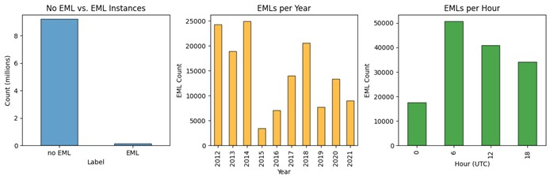

# Identification of the Elevated Mixed Layer Using a Random Forest Classifier

Authors: Margo Andrews, Mackenzie Garrett, and Caitlin Roufa

## I. Introduction and Background

The central contiguous United States (CONUS) is one of the most favorable regions for severe convective storms (SCSs) worldwide (Brooks et al. 2003; Taszarek et al. 2021). The elevated mixed layer (EML) is a well-established contributor to the high SCS frequency, influencing storm initiation, intensity, and suppression. EMLs are elevated layers of steep lapse rates with high potential temperature, the bases of which often act as a capping inversion. EMLs begin as hot, dry, well-mixed planetary boundary layers in the high terrain of the desert southwest, northern Mexico, or the Rocky Mountains, and are subsequently advected downstream off the elevated terrain (Carlson and Ludlam 1968; Carlson et al. 1983; Lanicci and Warner 1991). EML frequency peaks just downstream of the high terrain in the warm season, with a maximum over the southern Great Plains and northeastern Mexico in spring, and a lesser, northward displaced maximum over the central and northern Great Plains in summer (Ribeiro and Bosart 2018; Li et al. 2020; Andrews et al. 2024). 

The high frequency of EMLs over the central CONUS contributes to the relatively frequent overlap of necessary SCS ingredients—conditional instability, moisture, vertical wind shear, and a lifting mechanism (e.g., Johns and Doswell 1992). Typical synoptic patterns favoring EML formation in this region feature winds that veer with height, with moist, low-level southerly flow and southwesterly flow aloft (Lanicci and Warner 1991; Ribeiro and Bosart 2018). EMLs contribute to the development of conditional instability (commonly measured as convective available potential energy or CAPE) by introducing two characteristic environmental features to areas with already favorable conditions for deep, moist convection: 1) steep mid-level lapse rates; and 2) a capping inversion. The EML’s capping inversion inhibits or delays deep convection over a region, allowing solar heating to build CAPE over the mid-to-late afternoon without the dampening effects of excessive clouds or precipitation (Agard and Emanuel 2017). With more CAPE than there would be in the absence of the EML and its capping inversion, convection that does initiate may have stronger updrafts and a higher likelihood of being severe (Carlson and Ludlam 1968; Carlson et al. 1983; Graziano and Carlson 1987).

Due to the EML’s influence on SCSs, several studies have established EML climatologies using observed or reanalysis datasets (e.g., Lanicci and Warner 1991; Ribeiro and Bosart 2018; Li et al. 2020; Andrews et al. 2024). All studies to date have used objective criteria, which commonly include a minimum MUCAPE threshold, a minimum lapse rate threshold over a certain depth (e.g., $\geq 8^\circ C km^{-1}$ over 200 mb layer), a requirement that relative humidity decrease with height over the steep lapse rate layer, and minimum and maximum levels for the EML base. While using an objective algorithm has its benefits, limitations include the fact that the thresholds can be somewhat subjective and restrictive. Depending on the dataset, applying these algorithms can also be computationally expensive, as they require looping through data at every grid point and vertical model level. As an alternative, this project uses the EML dataset generated by Andrews et al. (2024) to determine if a random forest classifier can skillfully discriminate between EML and non-EML soundings in the warm season using relevant meteorological parameters from ERA5 vertical profiles.

## II. Data and Methods

Data for this project were produced using the European Center for Medium-Range Weather Forecasts Reanalysis Version 5 (ERA5), which has a 0.25-degree grid and 137 vertical levels (Hersbach et al. 2020). Hybrid sigma-level variables include pressure (p), temperature (T), zonal and meridional winds (u, v), specific humidity (q), and geopotential (z). The EML algorithm, developed by Andrews et al. (2024), employs 3-hourly ERA5 data to identify EMLs from 1979-2021, using the following criteria at each grid point:
1.	MUCAPE > 0 J kg−1
2.	ELR   8°C km−1 over a minimum depth of 200 hPa
3.	EML base minimum of 1000 m AGL and below 500 hPa
4.	Higher RH at EML top (compared to base)
5.	ELR < 8°C km−1 below EML base

Output from this algorithm includes a binary dataset, with values of 1 indicating an EML at a particular time and location, and values of 0 indicating no EML. Using the binary dataset as the label, the machine learning algorithm predicts which class (EML or no EML) a particular grid point belongs to using meteorological variables and parameters calculated with the same ERA5 hybrid-sigma level data (Table 1). Given limitations including computational resources and time, we limit the temporal time frame of the study to the 2012-2021 period, using 6-hourly data from the month of May, when EMLs are most frequent (e.g., Lanicci and Warner 1991). Our domain consists of the central CONUS (Fig. 1), covering the region where the greatest number of EMLs typically occur (e.g., Riberio and Bosart 2018; Andrews et al. 2024). 

Machine learning algorithms have been explored for use with gridded meteorological data. Random forest classifiers have been shown to be skillful at identification of meteorological phenomenon including tornadoes and hail in the ERA5 dataset and convective perils, drylines, other high impact weather and atmospheric features in short-range forecasts (Clark et al. 2015; Herman and Schumacher 2018; Gensini et al. 2021; Hill et al. 2020). Random forest algorithms are supervised machine learning models that build decision trees and then average the ensemble results of the decision trees (Breiman 2001). Each node in a decision tree is seeded with random input features from the training data. Decision trees continue branching until training data is exhausted or until a set stopping point is set. Aggregate classification results of each decision tree “vote” on the final classification result, providing the ability to compute statistics for model sensitivity, precision, and accuracy. Output classes for this study include EML, and non-EML. 

Prior to training a random forest classifier, the dataset is split into training, validation, and testing subsets. Since meteorological data has a temporal component, EMLs from one 6-hour time step are generally not independent of EMLs 6 hours later. As such, to ensure the subsets are independent of one another, the dataset needs to be split by time period, rather than randomly. Since the full dataset consists of 10 years of May data, the first seven years are assigned to the training subset (70%), the next year to the validation subset (10%), and the final two years to the testing subset (20%). Ideally, these subsets would have an equal ratio of EML to no EML cases. However, as is, the ratio of EML to non-EML classes ranges from 0.008 for the validation subset to 0.018 for the training subset. Future work will incorporate methods for balancing the EML and non-EML classes in the training and validation datasets. 

## III. Initial Results

Since EMLs are relatively rare events, the full dataset contains substantially fewer EML cases than no EML cases (Fig. 2). Within the 2012-2021 dataset, EMLs are most frequent in 2012, 2013, 2014, and 2018 (Fig. 2). Since the goal of the project is to find meaningful environmental parameters that can distinguish between EML and no EML classes, year will not be used as a predictor in the model. The diurnal distribution of EMLs indicates that EMLs are less common in the afternoon and early evening hours (18 and 0 UTC), likely due to the erosion of the EML by convection (Fig. 2). 


> Figure 2. The number of no EML vs. EML instances in the full dataset (left). The distribution of May EMLs per year (center) and per hour (right). 

In addition to the yearly and diurnal distributions, we examine the distributions of additional features associated with EMLs in the dataset (Fig. 3). Consistent with the literature, EMLs are most frequent in the southern half of the Great Plains in spring, roughly south of 40° N latitude. Vertical profiles associated with EMLs have steep lapse rates, relatively low relative humidity, and sufficient vertical wind shear to support deep, moist convection. Due to the presence of the EML’s capping inversion, many EMLs also have moderate to large MUCIN and fairly high 700 mb temperatures. 

## IV. Summary

This study examines the feasibility of using a random forest classifier to identify the EML in the central CONUS. EMLs are identified in ten years of 6-hourly May data from the ERA5 and converted into binary output. Select variables from ERA5 are used as feature input for the machine learning model. Feature importance is determined during the model development phase. Summary statistics of the final model output are assessed for the testing dataset. Class balance issues with a proportionally smaller number of EMLs compared to non-EMLs in the training and validation data are a limiting factor in model development; however, we anticipate a general assessment of the feasibility of using a random forest classifier in the identification of EMLs in ERA5. By demonstrating the diagnostic capabilities of the machine learning model, we provide a critical tool for severe weather forecasting in the central CONUS.

## V. References

Agard, V., and K. Emanuel, 2017: Clausius–Clapeyron Scaling of Peak CAPE in Continental Convective Storm Environments. *Journal of the Atmospheric Sciences*, **74**, 3043–3054, https://doi.org/10.1175/JAS-D-16-0352.1.

Andrews, M. S., V. A. Gensini, A. M. Haberlie, W. S. Ashley, A. C. Michaelis, and M. Taszarek, 2024: Climatology of the Elevated Mixed Layer over the Contiguous United States and Northern Mexico Using ERA5: 1979–2021. *Journal of Climate*, **37**, 1833-1851,  https://doi.org/10.1175/JCLI-D-23-0517.1.

etc. etc.

# Requirements Document

We identified the following requirements for this project:

| P01-01  | Label EML cases in a binary format – `calc_binary(data, dates)`   
|---------|------------| 
| Priority | High |
| Sprint | 1 |
| Assigned To | Margo and Cait |
| User Story   | As developers, we need to provide the ML model with a binary dataset of EML and non-EML cases to train the model. |                                                                                                                                       | 
| Requirements | |
| | 1. Pandas will be used to read in a CSV file.|
| | 2. Use ERA5 vertical profiles from May.|
| | 3. The dataset has a binary variable that labels EMLs and non-EMLs.|
| | 4. The Data uses criteria well established in previous literature to identify EMLs.|
| Acceptance Criteria | |
| | 1. Pandas successfully opens a data frame from the CSV file.|
| | 2. Uses Panda's filtering to check that ERA5 data is only from May.|
| | 3. Binary data set contains only 1s and 0s. 0's for no EML and 1's for presence of EML. |
| | 4. The data has metadata that implies the identification of EMLs based on previous literature.|
| Unit Test | | 
```
  # compare the label output by the EML algorithm to the manual label (0 for non-EML, 1 for EML)  
  def_test_binary_labels():
      input_vertical_profile = ds.sel(time='05-01-1994' , latitude=41.9 , longitude=88.7)
      label = EML_algorithm(input_vertical_profile)
      assert_equal(label, manual_label) 
```


| P02-01  | Make a list of predictor variables  
|---------|------------| 
| Priority | High |
| Sprint | 1 |
| Assigned To | Margo, Mackenzie, and Cait |
| User Story   | The developers must create a comprehensive list of predictor variables for our ML model, so that it can identify EMLs. |                                                                                                                                       | 
| Requirements | |
| | 1. The model must use sigma-level data.|
| | 2. Variables must be relevant to the EML.|
| | 3. Calculate variables with ERA5 data set on Triton.|
| Acceptance Criteria | |
| | 1. Use ERA5 data that explicitly implies the use of sigma-level data.|
| | 2. Relevant variables are verified using well-established literature.|
| | 3. Variables must be calculated using the ERA5 fields we have available (p, T, u, v, q, z). |
| Unit Test | | 
```
  N/A
```
