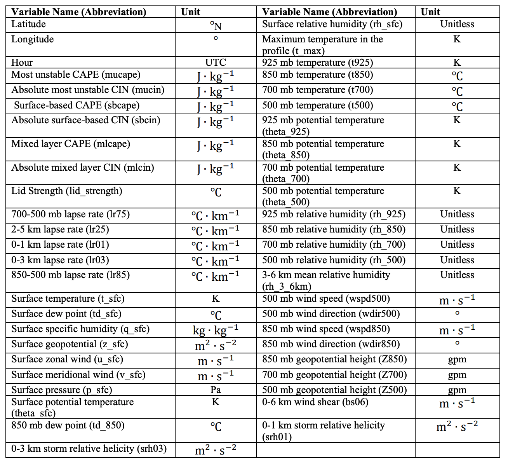
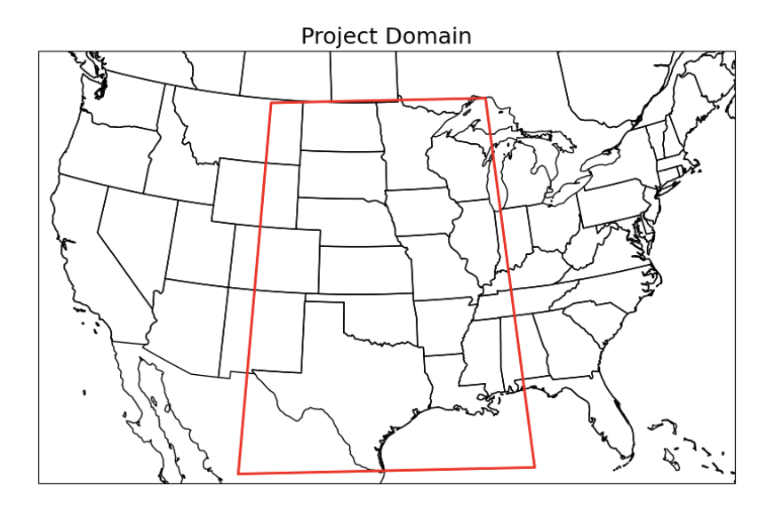
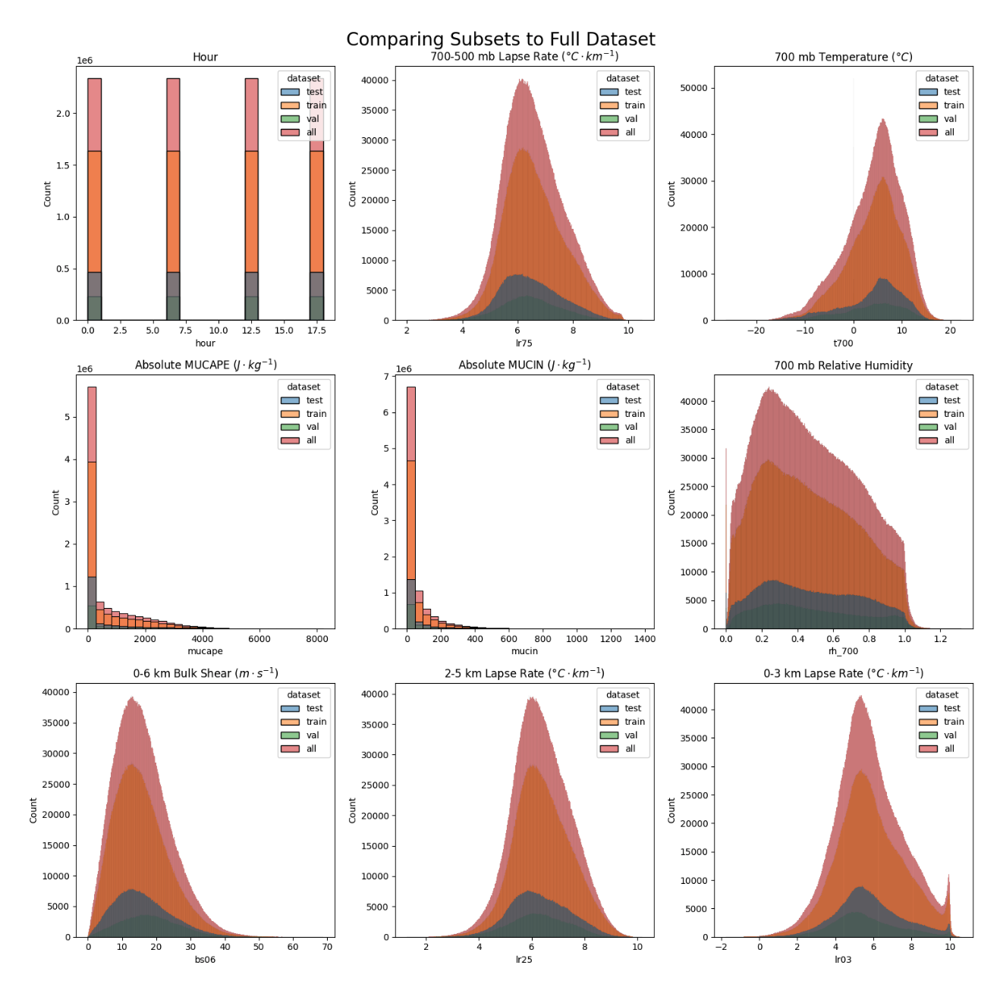
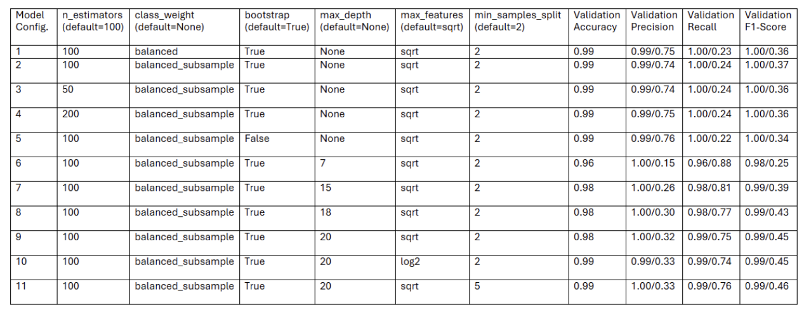
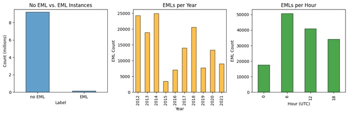
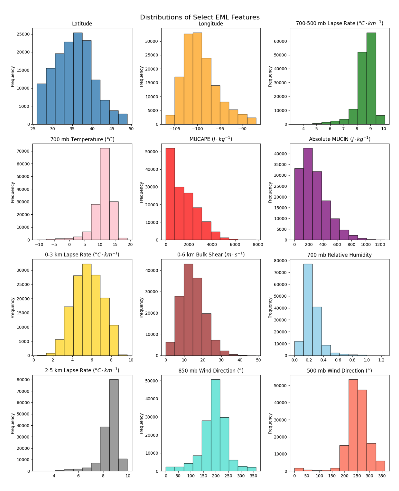
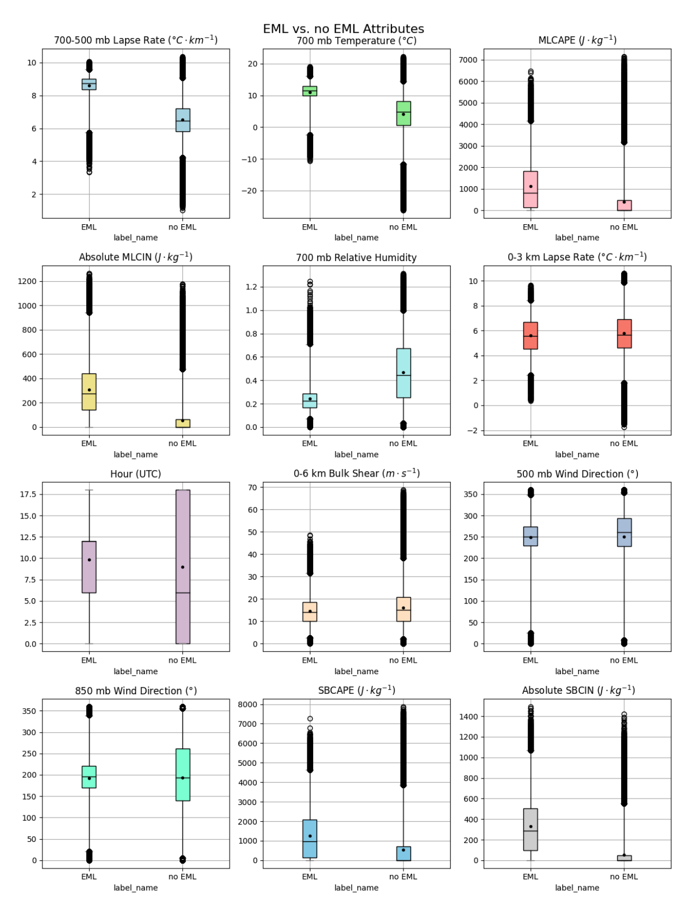
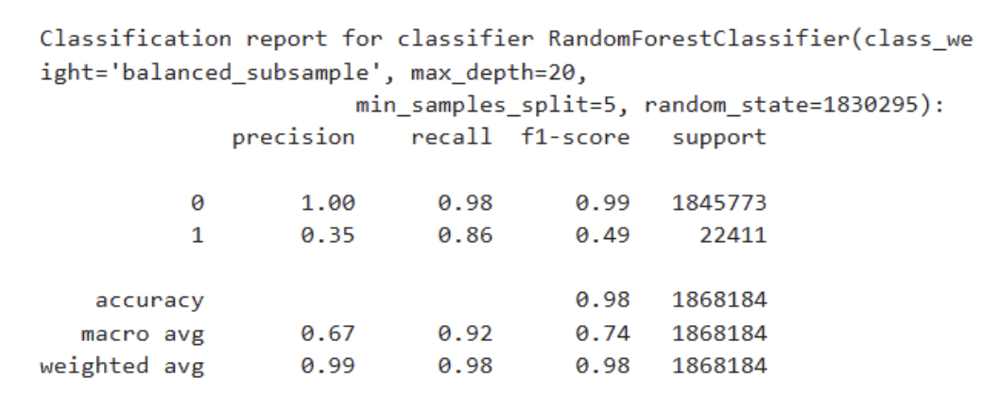
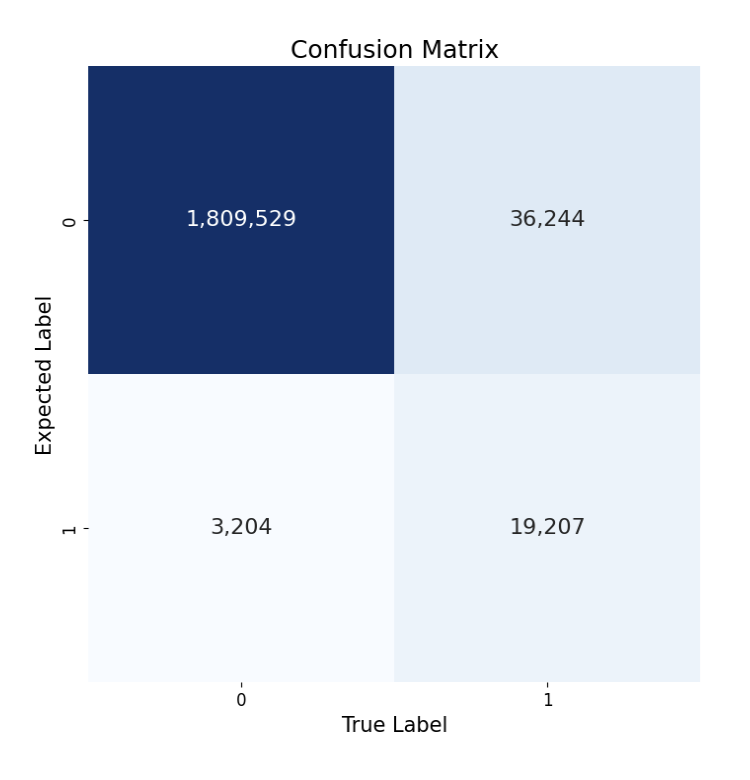
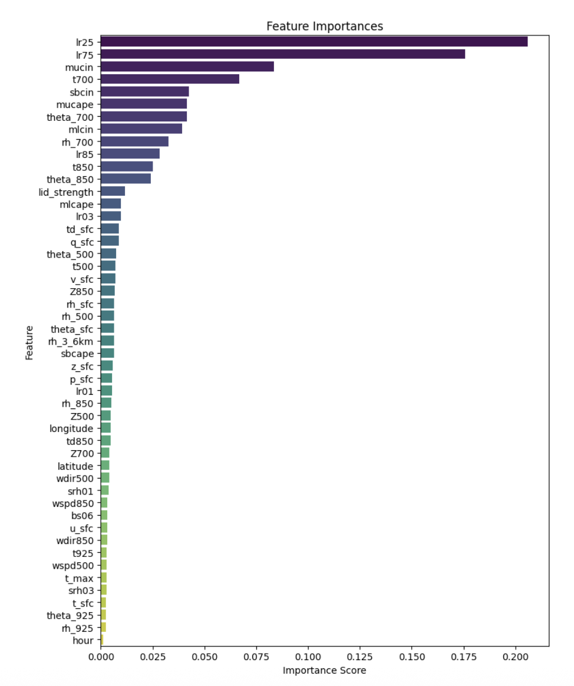

# Identification of the Elevated Mixed Layer Using a Random Forest Classifier

Authors: Margo Andrews, Caitlin Roufa, and Mackenzie Garrett

### Data Download

The EML data used for this project was created using sigma-level ERA5 data and the EML algorithm described in Andrews et al. (2024). The entire dataset is contained in one CSV file, with 10 years (2012-2021) of Central CONUS May vertical profiles, classified as EMLs or not EMLs, and the predictors for the random forest classifier. It is available for download at: https://niuits-my.sharepoint.com/:f:/g/personal/z1830295_students_niu_edu/EpAB9uDQ51FNlMh4N-0Z8YcBDfgCsxXvHCHeEB7RVj28-A?e=QS3NdR.  

### Dependencies

These Python packages are required to run the code in this repository. 
* Pandas 
* Matplotlib 
* NumPy 
* Cartopy 
* Seaborn 
* Scikit-learn

### Data Analysis

Jupyter notebooks are provided in the notebooks folder. Notebooks include those used to train the random forest classifier and create the figures below.

## I. Introduction and Background

The central contiguous United States (CONUS) is one of the most favorable regions for severe convective storms (SCSs) worldwide (Brooks et al. 2003; Taszarek et al. 2021). The elevated mixed layer (EML) is a well-established contributor to the high SCS frequency, influencing storm initiation, intensity, and suppression. EMLs are elevated layers of steep lapse rates with high potential temperature, the bases of which often act as a capping inversion. EMLs begin as hot, dry, well-mixed planetary boundary layers in the high terrain of the desert southwest, northern Mexico, or the Rocky Mountains, and are subsequently advected downstream off the elevated terrain (Carlson and Ludlam 1968; Carlson et al. 1983; Lanicci and Warner 1991). EML frequency peaks just downstream of the high terrain in the warm season, with a maximum over the southern Great Plains and northeastern Mexico in spring, and a lesser, northward displaced maximum over the central and northern Great Plains in summer (Ribeiro and Bosart 2018; Li et al. 2020; Andrews et al. 2024). 

The high frequency of EMLs over the central CONUS contributes to the relatively frequent overlap of necessary SCS ingredients—conditional instability, moisture, vertical wind shear, and a lifting mechanism (e.g., Johns and Doswell 1992). Typical synoptic patterns favoring EML formation in this region feature winds that veer with height, with moist, low-level southerly flow and southwesterly flow aloft (Lanicci and Warner 1991; Ribeiro and Bosart 2018). EMLs contribute to the development of conditional instability (commonly measured as convective available potential energy or CAPE) by introducing two characteristic environmental features to areas with already favorable conditions for deep, moist convection: 1) steep mid-level lapse rates; and 2) a capping inversion. The EML’s capping inversion inhibits or delays deep convection over a region, allowing solar heating to build CAPE over the mid-to-late afternoon without the dampening effects of excessive clouds or precipitation (Agard and Emanuel 2017). With more CAPE than there would be in the absence of the EML and its capping inversion, convection that does initiate may have stronger updrafts and a higher likelihood of being severe (Carlson and Ludlam 1968; Carlson et al. 1983; Graziano and Carlson 1987).

Due to the EML’s influence on SCSs, several studies have established EML climatologies using observed or reanalysis datasets (e.g., Lanicci and Warner 1991; Ribeiro and Bosart 2018; Li et al. 2020; Andrews et al. 2024). All studies to date have used objective criteria, which commonly include a minimum MUCAPE threshold, a minimum lapse rate threshold over a certain depth (e.g., $\geq$ 8 $^\circ$ C km $^{-1}$ over 200 mb layer), a requirement that relative humidity decrease with height over the steep lapse rate layer, and minimum and maximum levels for the EML base. While using an objective algorithm has its benefits, limitations include the fact that the thresholds can be somewhat subjective and restrictive. Depending on the dataset, applying these algorithms can also be computationally expensive, as they require looping through data at every grid point and vertical model level. As an alternative, this project uses the EML dataset generated by Andrews et al. (2024) to determine if a random forest classifier can skillfully discriminate between EML and non-EML soundings in the warm season using relevant meteorological parameters from ERA5 vertical profiles.

## II. Data and Methods

Data for this project were produced using the European Center for Medium-Range Weather Forecasts Reanalysis Version 5 (ERA5), which has a 0.25-degree grid and 137 vertical levels (Hersbach et al. 2020). Hybrid sigma-level variables include pressure (p), temperature (T), zonal and meridional winds (u, v), specific humidity (q), and geopotential (z). The EML algorithm, developed by Andrews et al. (2024), employs 3-hourly ERA5 data to identify EMLs from 1979-2021, using the following criteria at each grid point:
1.	MUCAPE > 0 J kg $^{−1}$
2.	ELR   8°C km $^{−1}$ over a minimum depth of 200 hPa
3.	EML base minimum of 1000 m AGL and below 500 hPa
4.	Higher RH at EML top (compared to base)
5.	ELR < 8°C km $^{−1}$ below EML base

Output from this algorithm includes a binary dataset, with values of 1 indicating an EML at a particular time and location, and values of 0 indicating no EML. Using the binary dataset as the label, the machine learning algorithm predicts which class (EML or no EML) a particular grid point belongs to using meteorological variables and parameters calculated with the same ERA5 hybrid-sigma level data (Table 1). Given limitations including computational resources and time, we limit the temporal time frame of the study to the 2012-2021 period, using 6-hourly data from the month of May, when EMLs are most frequent (e.g., Lanicci and Warner 1991). Our domain consists of the central CONUS (Fig. 1), covering the region where the greatest number of EMLs typically occur (e.g., Riberio and Bosart 2018; Andrews et al. 2024). 

> Table 1. Potential features for use in the machine learning model.



> Figure 1. The study domain, indicated by the red box. 

Machine learning algorithms have been explored for use with gridded meteorological data. Random forest classifiers have been shown to be skillful at identification of meteorological phenomenon including tornadoes and hail in the ERA5 dataset and convective perils, drylines, other high impact weather and atmospheric features in short-range forecasts (Clark et al. 2015; Herman and Schumacher 2018; Gensini et al. 2021; Hill et al. 2020). Random forest algorithms are supervised machine learning models that build decision trees and then average the ensemble results of the decision trees (Breiman 2001). Each node in a decision tree is seeded with random input features from the training data. Decision trees continue branching until training data is exhausted or until a set stopping point is set. Aggregate classification results of each decision tree “vote” on the final classification result, providing the ability to compute statistics for model sensitivity, precision, and accuracy. Output classes for this study include EML, and non-EML. 

Prior to training a random forest classifier using Scikit-Learn, the dataset is split into training, validation, and testing subsets. Since meteorological data has a temporal component, EMLs from one 6-hour time step are generally not independent of EMLs 6 hours later. As such, to ensure the subsets are independent of one another, the dataset needs to be split by time period, rather than randomly. Since the full dataset consists of 10 years of May data, the first seven years (2012-2018) are assigned to the training subset (70%), the next year (2019) to the validation subset (10%), and the final two years (2020-2021) to the testing subset (20%). Ideally, these subsets would have an equal ratio of EML to no EML cases. However, as is, the ratio of EML to non-EML classes ranges from 0.008 for the validation subset to 0.018 for the training subset.

Next, the training, validation, and testing subsets are compared to one another and to the full dataset. This is done to ensure that the distributions of predictors in each data set are fairly similar. If the distributions of these predictors are very different between subsets, model performance may suffer. A select subset of predictors indicates that while their distributions are not identical between datasets, they are very similar (Fig. 2).


> Figure 2. Comparing testing, training, and validation data subsets to the full dataset using count per hour, 700-500 mb lapse rate, 700 mb temperature, MUCAPE, MUCIN, 700 mb relative humidity, bulk shear, 2-5 km lapse rate, and 0-3 km lapse rate.

All features (Table 1) are used by the random forest classifier. Training is conducted using the training subset for 11 different model configurations (Table 2). The validation subset is used to assess each configuration’s model performance while tuning hyperparameters. Modified hyperparameters include number of estimators, class weight, bootstrap, maximum depth, maximum features, and minimum samples split (Scikit-learn 2025b). The number of estimators sets the number of decision trees in the forest, with more trees improving model accuracy and reducing variance at the expense of computation time. Class weight can adjust the weighting of input classes in the training data to balance classes with fewer cases in the dataset. Bootstrap set to “True” trains each decision tree on a random subset of the training data, while bootstrap set to “False” uses the entire training dataset. The max depth hyperparameter determines the number of levels of each decision tree. Extreme max depth values risk model overfitting (indicated by low recall, F1, and accuracy) and have high compute. Max features determines the number of random features selected for use in each decision tree, and tuning max features can reduce model overfitting and increase compute efficiency. Minimum samples split sets the minimum number of data samples that must be input prior to splitting a node in a decision tree, with higher values reducing overfitting, improving recall, F1, and accuracy. Initial tuning of the aforementioned model hyperparameters is completed using the RandomizedSearchCV and GridSearchCV algorithms; however, due to computation and time constraints, manual tuning of the model is conducted to find the optimal hyperparameters for high accuracy, precision, recall, and F1 score (Scikit-learn 2025a).

> Table 2. Random forest classifier model configurations include n estimators, class weight, bootstrap, max depth, max features, and min samples split. Validation accuracy, precision, recall, and F1-score are reported for non-EML/EML for each configuration.
 

The best model configuration, as determined by the best balance of validation precision and validation recall, is selected. Incorporating ‘balanced’ and ‘balanced subsample’ class weights had roughly the same impact on validation performance metrics, while increasing and decreasing the n estimators did not change model performance (Table 2). Incrementally increasing max depth decreased precision but increased recall and the F1 score. Ultimately, configuration 11 was selected as it has the highest F1-Score, suggesting the best balance between precision and recall. This model configuration uses ‘balanced_subsample’ for class weight, a max depth of 20, and a minimum samples split of 5. The generalizability of the classifier is then assessed using the testing subset. The final model summary includes a discussion of precision, recall, and feature importances. Ranking the features by importance provides insight into which variables are most useful at classifying EMLs. 

## III. Tentative Results
### A. Describing the EML Dataset

Since EMLs are relatively rare events, the full dataset contains substantially fewer EML cases than no EML cases (Fig. 3). Within the 2012-2021 dataset, EMLs are most frequent in 2012, 2013, 2014, and 2018 (Fig. 3). Since the goal of the project is to find meaningful environmental parameters that can distinguish between EML and no EML classes, year will not be used as a predictor in the model. The diurnal distribution of EMLs indicates that EMLs are less common in the afternoon and early evening hours (18 and 0 UTC), likely due to the erosion of the EML by convection (Fig. 3). 


> Figure 3. The number of no EML vs. EML instances in the full dataset (left). The distribution of May EMLs per year (center) and per hour (right). 

In addition to the yearly and diurnal distributions, we examine the distributions of additional features associated with EMLs in the dataset (Fig. 4). Consistent with the literature, EMLs are most frequent in the southern half of the Great Plains in spring, roughly south of 40° N latitude. Vertical profiles associated with EMLs have steep lapse rates, relatively low relative humidity, and sufficient vertical wind shear to support deep, moist convection. Due to the presence of the EML’s capping inversion, many EMLs also have moderate to large MUCIN and fairly high 700 mb temperatures.


> Figure 4. Histograms of various EML attributes that may be used in the machine learning model. 

To assess which features may be most useful for discriminating between the EML and non EML classes, box plots are used to compare the distributions of various features that may be used in the machine learning model (Fig. 5). Variables that appear to distinguish between the two classes particularly well include 700-500 mb lapse rate, 700 mb temperature, absolute MLCIN and SBCIN, and 700 mb relative humidity. EMLs tend to have steeper mid-level lapse rates, warmer 700 mb temperatures, higher CIN, and lower relative humidity than profiles without an EML. Although there is more overlap between the two labels than for the previous variables, the medians and means of SBCAPE and MLCAPE are fairly different for the two classes, suggesting that these variables may also be useful predictors for the model. 


> Figure 5. Box plots of potential machine learning model features for EMLs vs. no EMLs. 

### B. Assessing the Random Forest Classifier

Model results using the testing data set are comparable or better than results using the validation subset, implying the model can generalize for new data well. Results using the testing subset indicate that the model has high accuracy, predicting the correct label (no EML vs. EML) 98% of the time (Fig 6). However, despite the use of ‘balanced_subsample’ for class weight, the accuracy appears to be biased by the high number of true negatives in the dataset, meaning the number of instances where the model predicts no EML and there is no EML. Because the two classes are so imbalanced, with substantially more ‘no EML’ instances, the model can maximize accuracy by predicting no EML most of the time.  


> Figure 6. Classification report for selected random forest classifier, assessed using the testing subset. The ‘no EML’ class is indicated by 0 and the ‘EML’ class indicated by 1.

The precision for the no EML class is 1.00, meaning that nearly all the samples that the model predicts as no EMLs are actually no EML cases. The confusion matrix reveals that the model predicted no EML 1,812,733 times, with 1,809,529 of those predictions correct (Fig. 7). Precision is much lower for the EML class (0.35). Of the 55,451 instances labeled as ‘EML’ by the model, only 19,207 were correct.  


> Figure 7. The confusion matrix for the random forest classifier, assessed using the testing subset. The ‘no EML’ class is indicated by 0 and the ‘EML’ class is indicated by 1. 

Like precision, recall is higher for the no EML class compared to the EML class, although the difference in performance between the two classes is smaller. For the no EML class, recall is 0.98, with the model correctly identifying 1,809,529 of the 1,845,773 instances of the no EML label in the dataset. Recall for the EML class is 0.86, since the model correctly labeled 19,207 of the 22,411 EMLs in the testing dataset.

The F1 score considers both precision and recall and is often used for classification problems, particularly when the classes are imbalanced (Freiesleben and Molnar). The F1 score of 0.49 indicates poor performance for the EML class, which has reasonably high recall but low precision. The F1 score for the no EML class is 0.99, since both precision and recall are very high. These results indicate that despite the high accuracy, the model requires adjustments in order to be considered an effective classifier. Of the performance metrics examined, precision and recall are much more appropriate than accuracy for describing the model performance, since they are not biased by the very large number of true negatives in the dataset.  

Feature importance ranks the model features in terms of how heavily each influences the model’s predictions. Of the 49 features in the model, 2-5 km lapse rate and 700-500 mb lapse rate are by far the most important, followed by MUCIN, 700 mb temperature, SBCIN, and MUCAPE (Fig. 8). The predictors that are most important to the model make logical sense, as EMLs are defined as layers of steep mid-level lapse rates that typically have a capping inversion, generally indicated by 700 mb temperature and CIN. Additionally, due to the capping inversion, EMLs often have greater CAPE than non EML vertical profiles. The least important feature to the model was hour, which was initially a bit surprising considering spring EML frequencies do vary throughout the day (Andrews et al. 2024). However, using 6-hourly data, the diurnal differences may be less noticeable. Furthermore, while the hour feature may indicate slightly different frequencies of EMLs and non EMLs throughout the day, it likely does not help meaningfully distinguish EML from non EML vertical profiles. Other features indicated as relatively unimportant to the model are 925 mb relative humidity and potential temperature, surface temperature, and 0-3 km SRH. It is not surprising that these features are less important than many others. There is likely a wide range of values for these variables, with little separation in their distributions between the EML and no EML classes.   


> Figure 8. Feature importances in descending order for the random forest classifier with higher importance indicated by a higher importance score.

## IV. Summary

This study examines the feasibility of using a random forest classifier to identify the EML in the central CONUS. EMLs are identified in ten years (2012–2021) of 6-hourly May data from ERA5, with binary output indicating the presence (1) or absence (0) of an EML. Select variables calculated using ERA5 are used as feature input for the machine learning model. Of these variables, 2-5 km lapse rate, 700-500 mb lapse rate, MUCIN, 700 mb temperature, SBCIN, and MUCAPE are the most important predictors.   

Model accuracy is very high, predicting the correct class (EML vs. no EML) 98% of the time. However, the high accuracy is misleading because EMLs are rare events, leading to highly imbalanced classes. For example, within the testing subset, there are over 1.8 million cases without EMLs and roughly 22,400 EML cases. As a result of the class imbalance, the model predicts no EML the majority of the time to maximize accuracy. Therefore, the high accuracy is a reflection of the large number of true negatives in the dataset, rather than an indication that the model performs well for both classes. Precision and recall are more useful performance metrics for evaluating the generalizability of this model, since their calculations do not include true negatives. Precision and recall indicate that the model performs well at predicting the no EML class, but does a fairly poor job with the EML class. Although the model identifies 86% of actual EMLs in the dataset, of all the instances the model did classify as EMLs, only 35% of those were correct.  

To improve the model, the imbalanced classes need to be addressed. Class balancing methods such as adjusting the class weights were not sufficient to resolve the imbalance. Therefore, future work should focus on creating a dataset with an equal number of EML and no EML cases. Balancing the classes would discourage the model from predicting no EML the majority of the time to maximize accuracy. Future work could also use additional hyperparameters and more comprehensive methods of hyperparameter tuning, as well as incorporate additional metrics and visualizations to assess model results.  

## V. References

Agard, V., and K. Emanuel, 2017: Clausius–Clapeyron Scaling of Peak CAPE in Continental Convective Storm Environments. *Journal of the Atmospheric Sciences*, **74**, 3043–3054, https://doi.org/10.1175/JAS-D-16-0352.1.

Andrews, M. S., V. A. Gensini, A. M. Haberlie, W. S. Ashley, A. C. Michaelis, and M. Taszarek, 2024: Climatology of the Elevated Mixed Layer over the Contiguous United States and Northern Mexico Using ERA5: 1979–2021. *Journal of Climate*, **37**, 1833-1851,  https://doi.org/10.1175/JCLI-D-23-0517.1.

Breiman, L., 2001: Random Forests. *Machine Learning*, **45**, 5–32, https://doi.org/10.1023/A:1010933404324. 

Brooks, H. E., J. W. Lee, and J. P. Craven, 2003: The spatial distribution of severe thunderstorm and tornado environments from global reanalysis data. *Atmospheric Research*, **67–68**, 73–94, https://doi.org/10.1016/S0169-8095(03)00045-0. 

Carlson, T. N., and F. H. Ludlam, 1968: Conditions for the occurrence of severe local storms. *Tellus*, **20**, 203–226, https://doi.org/10.3402/tellusa.v20i2.10002. 

——, S. G. Benjamin, G. S. Forbes, and Y.-F. Li, 1983: Elevated Mixed Layers in the Regional Severe Storm Environment: Conceptual Model and Case Studies. *Monthly Weather Review*, **111**, 1453–1474, https://doi.org/10.1175/1520-0493(1983)111<1453:EMLITR>2.0.CO;2. 

Clark, A. J., A. MacKenzie, A. McGovern, V. Lakshmanan, and R. A. Brown, 2015: An Automated, Multiparameter Dryline Identification Algorithm. *Weather and Forecasting*, **30**, 1781-1794, https://doi.org/10.1175/WAF-D-15-0070.1. 

Freiesleben, T., C. Molnar, 2024: Bare-Bones Supervised Machine Learning. *Supervised Machine Learning for Science*, https://ml-science-book.com/.  

Gensini, V. A., C. Converse, W. S. Ashley, and M. Taszarek, 2021: Machine Learning Classification of Significant Tornadoes and Hail in the United States Using ERA5 Proximity Soundings. *Weather and Forecasting*, 2143-2160, https://doi.org/10.1175/WAF-D-21-0056.1. 

Graziano, T. M., and T. N. Carlson, 1987: A Statistical Evaluation of Lid Strength on Deep Convection. Weather and Forecasting, 2, 127–139, https://doi.org/10.1175/1520-0434(1987)002<0127:ASEOLS>2.0.CO;2. 

Herman, G. R., and R. S. Schumacher, 2018: Money Doesn’t Grow on Trees, but Forecasts Do: Forecasting Extreme Precipitation with Random Forests. *Monthly Weather Review*, **146**, 1571-1600, https://doi.org/10.1175/MWR-D-17-0250.1. 

Hersbach, H., and Coauthors, 2020: The ERA5 global reanalysis. *Quarterly Journal of the Royal Meteorological Society*, **146**, 1999–2049, https://doi.org/10.1002/qj.3803. 

Hill, A. J., G. R. Herman, and R. S. Schumacher, 2020: Forecasting Severe Weather with Random Forests. *Monthly Weather Review*, **148**, 2135-2161, https://doi.org/10.1175/MWR-D-19-0344.1. 

Johns, R. H., and C. A. Doswell, 1992: Severe Local Storms Forecasting. *Weather and Forecasting*, **7**, 588–612, https://doi.org/10.1175/1520-0434(1992)007<0588:SLSF>2.0.CO;2. 

Lanicci, J. M., and T. T. Warner, 1991: A Synoptic Climatology of the Elevated Mixed-Layer Inversion over the Southern Great Plains in Spring. Part I: Structure, Dynamics, and Seasonal Evolution. *Weather and Forecasting*, **6**, 181–197, https://doi.org/10.1175/1520-0434(1991)006<0181:ASCOTE>2.0.CO;2.    

Li, F., D. R. Chavas, K. A. Reed, and D. T. D. Ii, 2020: Climatology of Severe Local Storm Environments and Synoptic-Scale Features over North America in ERA5 Reanalysis and CAM6 Simulation. *Journal of Climate*, **33**, 8339–8365, https://doi.org/10.1175/JCLI-D-19-0986.1. 

Ribeiro, B. Z., and L. F. Bosart, 2018: Elevated Mixed Layers and Associated Severe Thunderstorm Environments in South and North America. *Monthly Weather Review*, **146**, 3–28, https://doi.org/10.1175/MWR-D-17-0121.1. 

Scikit-learn Tuning the hyper-parameters of an estimator,. *scikit-learn*. Accessed 4 May 2025a, https://scikit-learn/stable/modules/grid_search.html. 

Scikit-learn RandomForestClassifier,. *scikit-learn*. Accessed 4 May 2025b, https://scikit-learn/stable/modules/generated/sklearn.ensemble.RandomForestClassifier.html. 

Taszarek, M., J. T. Allen, M. Marchio, and H. E. Brooks, 2021: Global climatology and trends in convective environments from ERA5 and rawinsonde data. *NPJ Clim Atmos Sci*, **4**, 1–11, https://doi.org/10.1038/s41612-021-00190-x. 

## V. Appendix

# Requirements Document

We identified the following requirements for this project:

| P01-01  | Label EML cases in a binary format   
|---------|------------| 
| Priority | High |
| Sprint | 1 |
| Assigned To | Margo and Cait |
| User Story   | As developers, we need to provide the ML model with a binary dataset of EML and non-EML cases to train the model. |                                                                                                                                       | 
| Requirements | |
| | 1. Pandas will be used to read in a CSV file.|
| | 2. Use ERA5 vertical profiles from May.|
| | 3. The dataset has a binary variable that labels EMLs and non-EMLs.|
| | 4. The Data uses criteria well established in previous literature to identify EMLs.|
| Acceptance Criteria | |
| | 1. Pandas successfully opens a data frame from the CSV file.|
| | 2. Uses Panda's filtering to check that ERA5 data is only from May.|
| | 3. Binary data set contains only 1s and 0s. 0's for no EML and 1's for presence of EML. |
| | 4. The data has metadata that implies the identification of EMLs based on previous literature.|
| Unit Test | | 
```
  def test_binary_data(df):  
  
    """ 
    Unit test to ensure that the CSV file containing the EML dataset only
    contains 0s and 1s for the EML variable. Input is the Pandas DataFrame
    created using the CSV file.   
    """ 
    
    max_val = df[‘eml’].max() 
    min_val = df[‘eml’].min() 
    assert_equal(max_val, 1) 
    assert_equal(min_val, 0) 
```


| P02-01  | Make a list of predictor variables  
|---------|------------| 
| Priority | High |
| Sprint | 1 |
| Assigned To | Margo, Mackenzie, and Cait |
| User Story   | The developers must create a comprehensive list of predictor variables for our ML model, so that it can identify EMLs. |                                                                                                                                       | 
| Requirements | |
| | 1. The model must use sigma-level data.|
| | 2. Variables must be relevant to the EML.|
| | 3. Calculate variables with ERA5 data set on Triton.|
| Acceptance Criteria | |
| | 1. Use ERA5 data that explicitly implies the use of sigma-level data.|
| | 2. Relevant variables are verified using well-established literature.|
| | 3. Variables must be calculated using the ERA5 fields we have available (p, T, u, v, q, z). |
| Unit Test | | 
```
  N/A
```


| P03-01  | Identification of appropriate ML tools  
|---------|------------| 
| Priority | Medium |
| Sprint | 1 |
| Assigned To | Margo, Mackenzie, and Cait |
| User Story   | As developers we need to select ML tools that are appropriate for classifying vertical profiles as EMLs or not EMLs. |                                                                                                                                       | 
| Requirements | |
| | 1. Create a list of ML tools that could be used for gridded data.|
| | 2. Identify preferred ML tools.|
| | 3. Xarray or Pandas are compatible with the selected model.|
| Acceptance Criteria | |
| | 1. Verify ML tool is compatible with gridded data.|
| | 2. The list shows a top preferred ML tool and a backup ML tool.|
| | 3. ML tool successfully reads Xarray or Pandas style data set. |
| Unit Test | | 
```
  N/A
```


| P04-01  | Establish a format for preprocessed data  
|---------|------------| 
| Priority | High |
| Sprint | 1 |
| Assigned To | Margo and Cait |
| User Story   | The developers must determine how to organize and format our preprocessed data, such that it will be compatible with our selected machine learning model. |                                                                                                                                       | 
| Requirements | |
| | 1. Data works with the chosen ML tool.|
| | 2. Xarray or Pandas are used to subdivide the data.|
| | 3. Data must have a time, data, and location associated with each datapoint.|
| Acceptance Criteria | |
| | 1. No data errors with ML tool.|
| | 2. Must be achievable with Xarray or Pandas and the ERA5 data.|
| | 3. Data contains time, date, latitude, adn longitude columns. |
| Unit Test | | 
```
  N/A
```


| P05-01  | Establish preprocessing workflow  
|---------|------------| 
| Priority | High |
| Sprint | 1 |
| Assigned To | Margo, Mackenzie, and Cait |
| User Story   | The developers must establish a workflow for preprocessing our data prior to using the ML tools in order to continue development. |                                                                                                                                       | 
| Requirements | |
| | 1. Create a flow chart that displays preprocessing steps.|
| | 2. The flow chart lists how to process the data.|
| | 3. Flow chart identifies what python packages and data variables that need processing.|
| Acceptance Criteria | |
| | 1. Steps are presented in a flow chart.|
| | 2. The chart contains all data preprocessing steps.|
| | 3. Python packages and data variables are relevant and accessible with the ML tool. |
| Unit Test | | 
```
  N/A
```


| P06-01  | Calculate lapse rates  
|---------|------------| 
| Priority | Medium |
| Sprint | 1 |
| Assigned To | Margo and Cait |
| User Story   | As creators of an AI model, we need to calculate lapse rates in the atmosphere, to be used as predictors in our ML model. |                                                                                                                                       | 
| Requirements | |
| | 1. Use temperature and height variables from ERA5 dataset. |
| | 2. Calculates lapse rate for multiple levels.|
| | 3. Lapse rates are calculated in terms of degrees Celsius per kilometer.|
| Acceptance Criteria | |
| | 1. The only data used is ERA5 temperature and height data.|
| | 2. Unit tests show successful lapse rate calculations for multiple levels.|
| | 3. Lapse rate must be given in terms of degrees C per kilometer. |
| Unit Test | | 
```
  def test_lapse_rate(Z500, Z700, T500, T700):  
  
    """ 
    Unit test to ensure the 700-500 mb lapse rate is calculated correctly. 
    
    Parameters 
    ----------  
    
    Z500: float 
       The 500 mb geopotential height given in km. 
    Z700: float 
       The 700 mb geopotential height given in km. 
    T500: float 
       The 500 mb temperature, given in degrees C.  
    T700: float 
       The 700 mb temperature, given in degrees C. 
    """ 
    
    lr75 = - (T700 * units.degC - T500 * units.degC) / (Z700 * units.km - Z500 * units.km)

    assert_almost_equal(lr75, -8.25 * units.degC/km) 
```


| P07-01  | Calculate temperatures at various pressure levels  
|---------|------------| 
| Priority | Medium |
| Sprint | 1 |
| Assigned To | Margo and Cait |
| User Story   | As developers, we need to calculate temperatures at multiple pressure levels in the atmosphere (e.g., 1000, 900, 850 mb), to be used as predictors in our ML model. |                                                                                                                                       | 
| Requirements | |
| | 1. Use ERA5 temperature and pressure data. |
| | 2. Must account for the fact that at some locations in the high terrain certain pressure surfaces will be below surface.|
| | 3. Temperatures are calculated in terms of degrees Celsius.|
| Acceptance Criteria | |
| | 1. The only data used in the calculation is ERA5 temperature, pressure, and geopotential height data.|
| | 2. Identifies locations where certain pressure surfaces are below the surface and sets them equal to nan.|
| | 3. Temperatures must be given in degrees Celsius. |
| Unit Test | | 
```
  def test_temp_at_p_levs(T, p, Z):  
  
    """ 
    Unit test for the 700 mb temperature calculation (interpolation is needed
    because the data is sigma-level). Any location where 700 mb is below the
    surface is set to nan. 
    
    Parameters 
    ----------  
    
    T: float 
       The 500 mb temperature in degrees Celsius. 
    p: float 
     	   The 500 mb pressure in Pascals. 
    Z: float 
       The 700 mb geopotential height in kilometers. 
    """ 
    
    T700 = vinterp3d.dinterp3dz(T * units.degC, p*units.Pa , 700.) 
          T700[Z700<0.] = np.nan 
    
    assert_almost_equal(T700, 284.15 * units.Kelvin) 
```


| P08-01  | Calculate potential temperature at model levels 
|---------|------------| 
| Priority | Medium |
| Sprint | 1 |
| Assigned To | Margo and Cait |
| User Story   | As developers, we need to calculate potential temperatures at the ERA5 model levels, so that we can calculate potential temperature at select pressure levels/layers to be used as predictors in our ML model. |                                                                                                                                       | 
| Requirements | |
| | 1. Use temperature and pressure data from ERA5 dataset. |
| | 2. Temperature must be given in Kelvin, and pressure must be given in Pascals. |
| | 3. Use MetPy to calculate potential temperatures.|
| | 4. The resulting temperature is Kelvin. |
| Acceptance Criteria | |
| | 1. Must use ERA5 temperature and pressure data. |
| | 2. Temperature and pressure are verified to have correct units. |
| | 3. MetPy successfully calculates potential temperatures without an error. |
| | 4. Temperatures are verified to be in terms of Kelvin. |
| Unit Test | | 
```
  def test_potential_temp_calc(p, T): 
  
    """ 
    Unit test to verify that potential temperature calculation is correct.  
    
    Parameters 
    ----------  
    p: float 
       The pressure level (Pa) we’re calculating potential temperature at.  
    T: float 
     	   The temperature (K) at the above pressure level.  
    """ 
    
    theta = mpcalc.potential_temperature(p * units.Pa, T * units.Kelvin) 
    
    assert_almost_equal(theta, 295.88 * units.Kelvin, 1) 
```


| P09-01  | Calculate MUCAPE and MUCIN 
|---------|------------| 
| Priority | Medium |
| Sprint | 1 |
| Assigned To | Margo and Cait |
| User Story   | As developers, we need to calculate most unstable CAPE and CIN using ERA5 to be used as predictors in our ML model. |                                                                                                                                       | 
| Requirements | |
| | 1. Use virtual temprature, pressure, mixing ratio, and geopotential height from ERA5 dataset. |
| | 2. Use MetPy to calculate most unstable CAPE and CIN. |
| | 3. Most unstable CAPE and CIN are calculated in terms of J/kg.|
| Acceptance Criteria | |
| | 1. Must use virtual temperature, pressure, mixing ratio, and geopotential height calculated from ERA5 base variables. |
| | 2. MUCAPE and MUCIN are calculated without an error. |
| | 3. Resulting MUCAPE and MUCIN are verified to be in terms of J/kg. |
| Unit Test | | 
```
  def test_MUCAPE_MUCIN(p, tv, w, Z):  
  
    """ 
    Unit test to ensure that MUCAPE and MUCIN calculations are correct.  
    
    Parameters 
    ----------  
    p: float 
       A single vertical profile of pressure in Pa.  
    tv: float 
     	   A single vertical profile of pressure virtual temperature in Kelvin.  
    w: float 
     	   A single vertical profile of surface mixing ratio in kg/kg. 
    Z: float 
       A single vertical profile of geopotential height in meters.  
    """ 
    
     	mucape_tv, mucin_tv = calc_cape.mucape_plev( 
        p.values, ds1.tv.values, w.values, Z.values, Z.values[-1,:,:], 
        p.values[-1,:,:], ds1.tv.values[-1,:,:], w.values[-1,:,:])

    assert_almost_equal(mucape_tv, 1293.2 * units.J/kg, 0) 
    assert_almost_equal(mucin_tv, -103.9 * units.J/kg, 0)  
    print(‘All tests passed’) 
```

| P10-01  | Calculate relative humidity at the ERA5 model levels
|---------|------------| 
| Priority | Medium |
| Sprint | 1 |
| Assigned To | Margo and Cait |
| User Story   | As developers, we need to calculate relative humidity from the ERA5 dataset. |                                                                                                                                       | 
| Requirements | |
| | 1. Use temperature, pressure, and specific humidity from the ERA5 dataset. |
| | 2. Temperature must be given in Kelvin. Pressure must be given in Pascals. Specific humidity must be given in kilograms/kilogram. |
| | 3. Use MetPy to calculate relative humidity at each level.|
| | 4. Units are dimensionless.|
| Acceptance Criteria | |
| | 1. Must use ERA5 temperature, pressure, and specific humidity data. |
| | 2. Temperature, pressure, and specific humidity are verified to have correct units. |
| | 3. MetPy successfully calculates relative humidity without an error using the unit test. |
| | 4. Units are verified to be dimensionless.|
| Unit Test | | 
```
  def test_relative_humidity(p, T, q): 
  
    """ 
    Unit test to ensure relative humidity calculations are correct.  
    
    Parameters 
    ----------  
    p: float 
      Pressure in Pa.  
    T: float 
     	   Temperature in Kelvin.  
    q: float 
     	   Specific humidity in kg/kg.  
    """ 
    
    RH = mpcalc.relative_humidity_from_specific_humidity(p, T, q) * 100 
    assert_almost_equal(RH, 54.45) 
```

| P11-01  | Develop Project Workflow
|---------|------------| 
| Priority | Medium |
| Sprint | 1 |
| Assigned To | Margo, Mackenzie, and Cait |
| User Story   | As developers, we must define the scope of our project by identifying preprocessing, ML, and testing steps, and incorporating these into a project workflow. |                                                                                                                                       | 
| Requirements | |
| | 1. Create a flow chart with preprocessing steps, ML tool steps, and testing steps. |
| | 2. Identify an estimated time frame for each step. |
| Acceptance Criteria | |
| | 1. Steps are presented in a flow chart that incorporates all preprocessing steps, ML steps, and testing steps. |
| | 2. Each step is achievable in the time we have available to us. |
| Unit Test | | 
```
  N/A 
```
